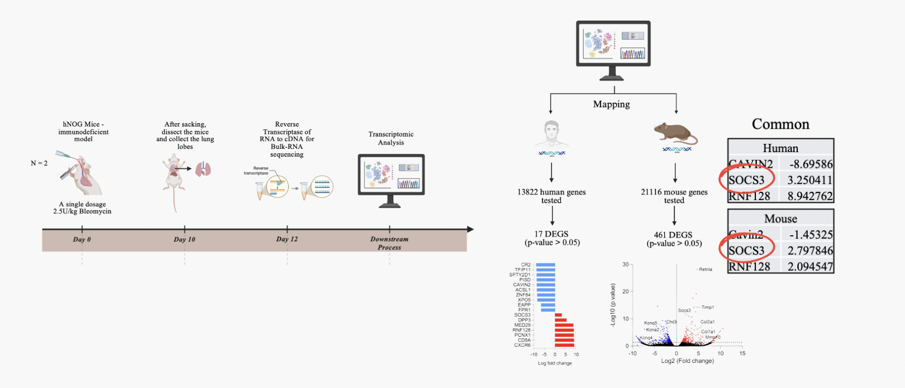
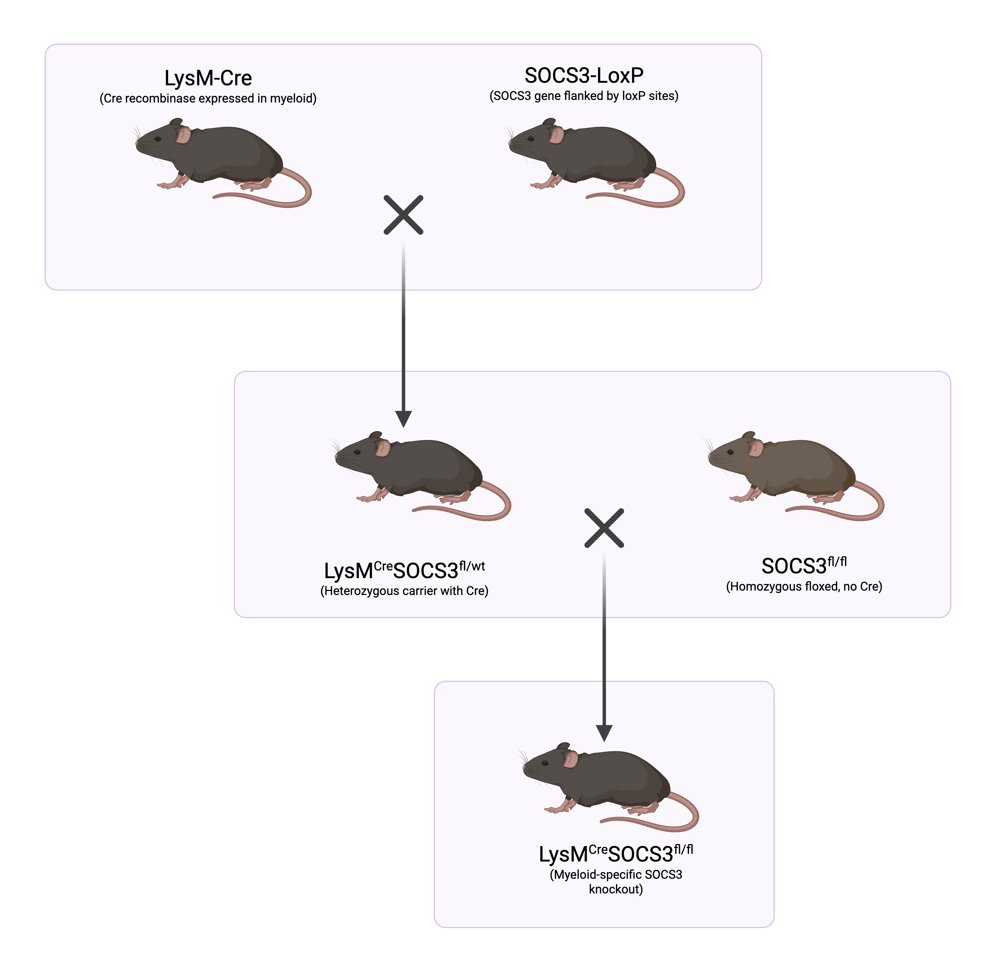
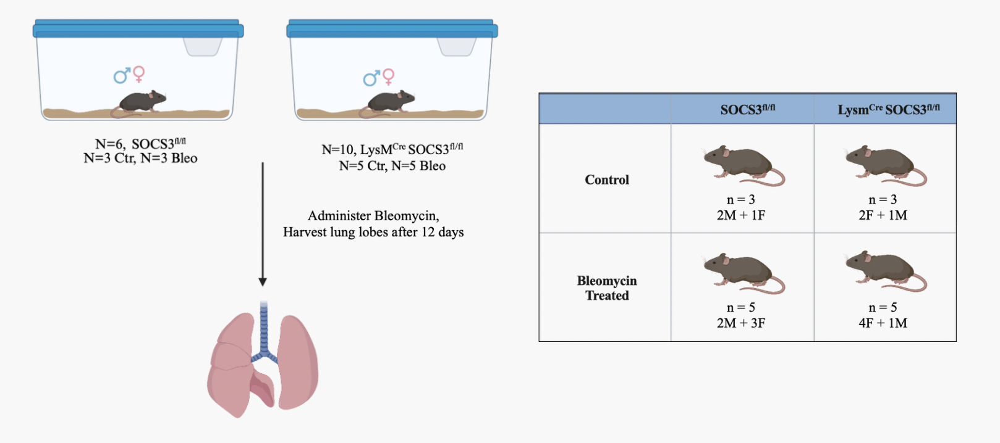

<strong style="font-family:'Times New Roman'; font-size:12pt;">EIM-431: Deciphering the Role of SOCS3 in Pulmonary Fibrosis</strong>
  
  
CDE4301 Final Report AY 2025/26
  
<strong style="font-family:'Times New Roman'; font-size:12pt;">Submitted by</strong>
 
Cheekoty Prerana Aditi, A0266468M
  
<strong style="font-family:'Times New Roman'; font-size:12pt;">A*STAR Supervisors</strong>
 
Dr Amit Singhal, Dr Sheetal Saini  
 
<strong style="font-family:'Times New Roman'; font-size:12pt;">NUS Supervisor</strong>
 
Dr Tang Kok Zuea 

  
  

# <strong>Acknowledgements</strong> 
I would firstly like to thank my supervisor, Dr Tang Kok Zuea, for his unwavering guidance and encouragement. His advice and steady support have been instrumental in shaping my approach and helping me grow through this project.

I would also like to extend my heartfelt gratitude to my PI, Prof. Amit Singhal, for his invaluable support. His insights, constructive feedback, and vision have been a constant source of inspiration, enabling me to push myself further and gain a deeper understanding of my work.

I am especially thankful to my supervisor, Dr. Sheetal, for her patient mentorship. Her willingness to provide direction, clarify doubts, and offer thoughtful advice has been an anchor throughout the duration of the project.

Lastly, I am deeply grateful to my lab members - Saiji, Loukas, Annabel, Mardi, Yuxi, Yao, Andrea, Wenning, and Sakshi for their support and in making this experience both enriching and enjoyable.

# Table of Contents

- [Acknowledgements](#acknowledgements) .......................................... 2

- [1. Introduction](#1-introduction) ............................................ 4

- [2. Bleomycin-induced Pulmonary Fibrosis](#2-bleomycin-induced-pulmonary-fibrosis) ............................................ 6
  - [2.1 Bleomycin BLM-Induced Pulmonary Fibrosis PF Model](#2-1-bleomycin-blm-induced-pulmonary-fibrosis-pf-model) .......... 6
  - [2.2 SOCS3 Protein and Signalling Pathway](#22-socs3-protein-and-signalling-pathway) .......... 8

- [3. Research Hypothesis and Objectives](#3-research-hypothesis-and-objectives) ...................... 8
  - [3.1 Hypothesis](#31-hypothesis) ............................................. 8
  - [3.2 Objectives](#32-objectives) ............................................. 8

- [4. Methodology](#4-methodology) .............................................. 9
  - [4.1 Study Timeline](#41-study-timeline) ..................................... 9
  - [4.2 Ethical Considerations](#42-ethical-considerations) ..................... 10
  - [4.3 Rationale for SOCS3 Conditional Knockout Model](#43-rationale-for-socs3-conditional-knockout-model) .......... 10
  - [4.4 Optimization - Pilot Study](#44-optimization---pilot-study) .......... 10
  - [4.5 Experimental Design for Main Study 1](#45-experimental-design-for-main-study-1) .......... 12
  - [4.6 Experimental Design for Main Study 2](#46-experimental-design-for-main-study-2) .......... 12

- [5. Results and Discussion](#5-results-and-discussion) ......................... 13
  - [5.1 Main Study 1](#51-main-study-1) ........................................ 13
    - [5.1.1 Phenotype](#511-phenotype) ........................................ 13
    - [5.1.2 Genotype](#512-genotype) .......................................... 13
      - [5.1.2a Genotyping](#512a-genotyping) .................................. 14
      - [5.1.2b Hydroxyproline Assay Experiment](#512b-hydroxyproline-assay-experiment) .. 14
      - [5.1.2c qPCR](#512c-qpcr) ............................................. 15
  - [5.2 Main Study 2](#52-main-study-2) ........................................ 17
    - [5.2.1 Phenotype](#521-phenotype) ........................................ 17
    - [5.2.2 Genotype](#522-genotype) .......................................... 17
      - [5.2.2a Genotyping](#522a-genotyping) .................................. 17
      - [5.2.2b Hydroxyproline Assay Experiment](#522b-hydroxyproline-assay-experiment) .. 17
      - [5.2.2c qPCR](#522c-qpcr) ............................................. 18

- [6. Conclusion](#6-conclusion) ................................................ 19

- [7. Future Works](#7-future-works) ............................................ 20

- [8. References](#8-references) ................................................ 21

# <strong>1. Introduction</strong>
Pulmonary fibrosis (PF) is a lung disease that occurs when the  lung tissue becomes damaged and scarred (_refer to figure 1_), resulting in fibrotic tissue blocking the movement of oxygen from inside the tiny air sacs in the lungs into the bloodstream (What Is Pulmonary Fibrosis?, 2025). In advanced stages, the lung tissue may develop a distinctive “honeycomb” appearance, which reflects extensive structural damage (Cheng, 2025). This pattern consists of numerous cystic airspaces with thick fibrous walls embedded within densely scarred tissue, which not only makes the lungs less efficient at delivering oxygen, but also reduces their ability to expand. This increased stiffness requires the lungs to work harder during breathing, demanding more energy, often leading to shortness of breath and difficulty performing everyday activities (Pulmonary Fibrosis - Symptoms and Causes, 2025). 

 
_Figure 1. Differences between a healthy lung and a lung affected by PF_

PF is thought to occur due to genetic predisposition or environmental factors but in most cases  idiopathic pulmonary fibrosis (IPF) is the most common, affecting 13 to 20 people per 100,000 (Variations Emerge among Adults Living with Pulmonary Fibrosis, 2023). Based on this prevalence, Singapore likely has around 1000 patients (More Than 70 Percent of Patients With IPF Are Males and Smokers or Ex-smokers, 2017). It appears to be quite prevalent in the Asia-Pacific region, with reported rates ranging from 0.57 to 4.51 per 10,000, largely due to South Korea, which records the highest incidence worldwide. In comparison, prevalence rates are slightly lower in North America from 2.40 to 2.98 per 10,000 and even lower in Europe, where incidence rates are 0.33 to 2.51 per 10,000. When prevalence estimates were compared to country-specific rare disease thresholds, IPF met the definition of a rare disease in all countries except South Korea (Maher et al., 2021). 

Although IPF is classified as a rare disease in most countries, it affects an estimated 3 million people worldwide, occurring predominantly in older adults (Koudstaal & Wijsenbeek, 2023). Studies have consistently shown that the mean age of patients with IPF is around 65 years (Raghu et al., 2014), with the occurrence of IPF in young adults being extremely rare (Saeed et al., 2023). This strong association between age and IPF poses a growing concern in an ageing society like Singapore, where almost one in five citizens are aged 65 or older. This proportion is projected to rise to one in four by 2030, highlighting the need for earlier recognition and timely intervention (SG60: Why Ageing Needs a New Narrative in Singapore, 2025).

More recently, PF has also been recognised as an important long-term complication following COVID-19 infection. According to one study (Hama Amin et al., 2022), 44.9%  of COVID-19 survivors were found to have developed PF. Similarly, another study reported lung fibrosis as a significant post-COVID complication, occurring in 42% of patients (Lazar et al., 2024). 

Despite its increasing prevalence, only two antifibrotic drugs, pirfenidone and nintedanib, are available in the market. Although both drugs slow PF progression, they do not cure or reverse the disease (Man et al., 2024). As a result, the prognosis for patients remains poor, with a median survival rate of  three to five years after diagnosis.

This limited therapeutic efficacy highlights the urgent need for the development of more effective treatments. However, the development of novel drugs for PF is hampered by significant challenges, including the lack of sensitive clinical outcomes and reliable biomarkers that can provide early indications of patient benefit (White et al., 2022). In addition, drug development in respiratory medicine is becoming increasingly time-consuming, with higher risks of failure and escalating costs (Sun et al., 2022). These challenges are further compounded by the difficulty of accurately modelling the complex features of the disease in preclinical systems. 

# <strong>2. Bleomycin-induced Pulmonary Fibrosis</strong> 
### <strong>2.1 Bleomycin (BLM)-Induced Pulmonary Fibrosis (PF) Model </strong>
Given these limitations, the development of preclinical models is critical for improving our understanding of disease mechanisms. One widely used model is the bleomycin (BLM)-induced PF model, which produces lung injury and fibrotic changes that closely resemble key features of human IPF. It is also regarded by the American Thoracic Society as the best-characterized animal model for preclinical testing (Zhang et al., 2019).

Bleomycin is a chemotherapeutic drug commonly used in the treatment of cancers such as Hodgkin lymphoma. Its relevance to PF was first recognised when approximately 10-20% of patients receiving bleomycin developed lung toxicity (Southwest Journal of Pulmonary, Critical Care and Sleep - Pulmonary - a Case of Progressive Bleomycin Lung Toxicity Refractory to Steroid Therapy, 2023). This toxicity often presents as bleomycin-induced pneumonitis, which can progress to pulmonary fibrosis. These observations provided the rationale for developing bleomycin-based experimental models to study the mechanisms underlying pulmonary fibrosis.

To better understand disease pathogenesis, the BLM-induced PF model has since been applied across a wide range of species, including mice, rats, hamsters, dogs, and primates. Among these, mice are the most commonly used due to their abundance and well-characterized genetic background (Why Do We Use Mice in Research?, 2026). Although no current animal model fully recapitulates all features of human PF, largely because they do not reproduce the slow and irreversible progression characteristic of idiopathic pulmonary fibrosis, studies using murine BLM models have nonetheless provided valuable insights into the roles of cytokines, growth factors, and signalling pathways involved in pulmonary fibrosis (Moeller et al., 2008).

Apart from the BLM-induced PF model, several other experimental models have been used to study lung fibrosis. For example, the silica-induced fibrosis model is characterised by the persistence of fibrotic lesions. Despite this advantage, its use is limited by several major drawbacks, including the need for costly aerosol delivery systems, and long latency periods of up to 16 weeks before fibrosis develops. In addition,  fibrotic patterns are poorly reproducible, and key interstitial pneumonia like features are absent.. As a result, its applicability in preclinical studies has been severely restricted. Similarly, fibrosis can also be induced following a single intratracheal administration of asbestos fibres. However, the resulting fibrotic lesions are typically centrally located rather than subpleural and are often unevenly distributed between the lungs, reducing the model’s relevance to human disease (Tashiro et al., 2017).  

In contrast, the BLM-induced PF model offers several distinct advantages. In addition to its strong clinical relevance, it induces lung injury followed by fibrotic remodelling within approximately 15 days, making it a time-efficient, reproducible, and reliable model for investigating disease mechanisms (Zhang et al., 2019).

Building on these advantages, our lab previously developed a humanized mouse model in which CD34⁺ hematopoietic stem cells, peripheral blood mononuclear cells, and other human immune cells were engrafted into immunodeficient mice, enabling the study of human-specific immune responses in vivo in a controlled experimental setting (Humanized Immune System Mice for Preclinical Research, 2023). Leveraging this model, bulk transcriptomic analysis was performed to investigate molecular changes associated with disease progression. This approach revealed several genes that were differentially regulated in both the humanized mice and human PF samples (_refer to figure 2_). Notably, _SOCS3_ and _RNF128_ emerged as consistently dysregulated genes, prompting further investigation into their potential roles and the underlying pathways involved in pulmonary fibrosis.

 
  
_Figure 2. Transcriptomic analysis of lung tissue from humanized mice_

### <strong>2.2 SOCS3 Protein and Signalling Pathway  </strong>
Transcriptomic analysis showed that _SOCS3_ and _RNF128_ were upregulated following bleomycin administration in humanized mice. While _RNF128_ has primarily been associated with allergic airway inflammation in previous studies, _SOCS3_ is widely recognised as a key regulator of cytokine signalling and immune responses.

_SOCS3_ is known to function as a negative regulator of inflammatory signalling, particularly in pathways activated by cytokines such as those involving STAT3. Upon phosphorylation, STAT3 becomes activated and promotes the transcription of target genes that drive inflammatory and fibrotic responses. STAT3 activation also induces the expression of _SOCS3_, which in turn acts as a negative feedback regulator, suppressing further STAT3 activity. Thus, _SOCS3_ maintains immune homeostasis by preventing excessive cytokine signalling and tissue damage (Yoshimura et al., 2007).

Given that persistent STAT3 activation has been linked to chronic inflammation and fibrosis, the observed upregulation of _SOCS3_ in the preliminary data may represent a natural response aimed at counteracting overactive STAT3 signalling. This makes _SOCS3_ a particularly relevant target protein for further investigation, as its absence in immune cells could disrupt this feedback control, leading to sustained STAT3 activation.

# <strong>3. Research Hypothesis and Objectives</strong> 
### <strong>3.1 Hypothesis </strong>
The hypothesis for this dissertation is, “The lack of _SOCS3_ in myeloid cells leads to sustained STAT3 activation, thereby enhancing inflammation and promoting PF in murine models”. 

### <strong>3.2 Objectives </strong>
Based on this hypothesis, the study is structured around two main objectives:
1. Effect of myeloid specific _SOCS3_ deficiency on bleomycin induced pulmonary fibrosis 
2. Effect of myeloid specific _SOCS3_ deficiency on immune markers in bleomycin induced fibrotic lung
   
This FYP primarily focused on Objective 1, beginning with validation of the conditional knockout mouse model, followed by phenotypic characterization of _SOCS3_ deficiency in myeloid cells after bleomycin treatment. Phenotypic assessments included measurements of body weight and lung weight. Genotypic effects of _SOCS3_ deficiency were confirmed by evaluating _SOCS3_ expression using Hydroxyproline Assay (HPA) and quantitative PCR (qPCR). Experimental workflows were optimized during the pilot study to ensure reliable and reproducible results.

Preliminary work for Objective 2 was also initiated to investigate the potential impact of myeloid-specific _SOCS3_ deficiency on immune markers in bleomycin-induced fibrotic lungs, with qPCR used to assess genes associated with various immune cell populations.

It should be noted that all work conducted during this FYP focused on validating the conditional knockout model and assessing phenotypic and genotypic effects. The study was not designed to directly investigate STAT3 activation or its associated signalling pathways.

# <strong>4.  Methodology</strong> 
### <strong>4.1 Study Timeline </strong>
The project was carried out in several distinct phases. The first phase involved reviewing relevant literature to better understand the role of _SOCS3_ in pulmonary fibrosis, and completing the necessary animal handling and laboratory training for the project. This was followed by a series of preliminary experiments aimed at optimising experimental procedures and establishing suitable conditions for the main study.

After optimizing these experimental conditions, the main experiments were conducted to validate _SOCS3_ expression and assess the associated cellular and molecular responses in the BLM model. Experimental data were then analyzed using Microsoft Excel and GraphPad Prism to evaluate results and guide subsequent experiments.

### <strong>4.2 Ethical Considerations</strong>
Prior to commencing any experiments, training at the A*STAR’s Biological Resource Centre was completed to ensure full compliance with ethical standards for mouse care, in strict accordance with protocols approved by the Institutional Animal Care and Use Committee. 

### <strong>4.3 Rationale for SOCS3 Conditional Knockout Model</strong>
Structurally, _SOCS3_ is a relatively small protein comprising 225 amino acids, with an approximate molecular weight of 24.75 kDa, spanning approximately 850 base pairs on chromosome 17q25.3. It consists of two exons, with Exon 2 being functionally critical as it encodes key domains including SH2 and SOCS, required for inhibitory activity.

To investigate the role of _SOCS3_ in immune regulation within myeloid cells, a conditional knockout strategy was employed. LoxP sites were inserted flanking Exon 2, allowing targeted deletion of this functional region. In the absence of Cre recombinase, the gene remains intact and fully functional. However, when Cre is expressed, it recognises the loxP sites and excises Exon 2, resulting in loss of functional _SOCS3_ protein.

For myeloid-specific deletion, the LysMCre mouse model is widely used, in which Cre recombinase expression is driven by the Lyz2 promoter, active in myeloid cells including macrophages, monocytes, and granulocytes. Crossing LysMCre mice with *SOCS3*fl/fl mice (_refer to figure 3_) results in Cre-mediated recombination in these cells, leading to targeted _SOCS3_ deletion in the myeloid compartment.

 
  
_Figure 3. Breeding strategy for conditional SOCS3 knockout mice_

This model allows targeted investigation of _SOCS3_ in immune responses and its contribution to inflammation and fibrosis, forming the basis for the pilot and main studies described below. 

### <strong>4.4 Optimization - Pilot Study</strong>
For the pilot study, two mouse strains were used: LysMCre *SOCS3*fl/fl, representing complete myeloid-specific _SOCS3_ deletion, and LysMCre *SOCS3*fl/wt serving as a heterozygous partial control with one functional SOCS3 allele, with all mice being female. Genotyping was then performed to confirm the genetic status of the mice, verifying the presence of both heterozygous and homozygous _SOCS3_ deletions within the experimental cohort. 

Within each genotype, a subset of mice received a single intratracheal dose of bleomycin (2.5 U/kg) to induce PF, while the remaining mice were maintained as baseline controls. Initial phenotypic assessment involved monitoring body weight changes on days 1, 5, 8, and 12 over a 13-day period, during which bleomycin-treated mice showed a significant reduction in body weight.

After this period, the mice were sacrificed, with lung tissues harvested and serum samples collected for downstream analysis. Bleomycin-treated mice showed an increase in lung weight, consistent with fibrotic progression following induction. HPA in lung lysate and serum samples were performed to quantify collagen deposition, providing an objective measure of lung fibrosis severity. In addition, qPCR was used to validate myeloid-specific _SOCS3_ deletion by measuring relative _SOCS3_ expression in lung tissue.

However, the pilot study had three main limitations. Firstly, a heterozygous partial control was used instead of a true wild-type control. While the results obtained for the HPA in lung lysates and _SOCS3_ validation aligned with the expected outcomes of my hypothesis, heterozygous mice have varying levels of _SOCS3_ expression, making it more difficult to clearly distinguish the effects of complete _SOCS3_ loss. Including wild-type controls would have provided a clearer reference for normal _SOCS3_ expression and fibrosis levels, allowing for more definitive comparisons.

Secondly, serum HPA levels were unexpectedly higher in baseline control groups compared to bleomycin-treated mice. This discrepancy likely reflects the fact that serum hydroxyproline represents circulating collagen fragments derived from multiple tissues and is influenced by systemic metabolic and dilutional factors. In contrast, HPA measurements from lung lysates were higher in bleomycin-treated mice than in controls, providing a more direct and reliable indicator of local collagen deposition and fibrosis severity.

Lastly, the exclusive use of female mice may limit the generalisability of the findings, as sex-specific differences in immune responses and fibrosis progression have been reported (Lamichhane et al., 2022).

Despite these limitations, the data obtained was significant to proceed with the main study, providing a strong foundation for further investigation. 

### <strong>4.5 Experimental Design for Main Study 1</strong>
Building on the findings and limitations identified in the pilot study, main study 1 was designed with several key modifications. The study included 6 *SOCS3*fl/fl wild-type (WT) mice that were used as true controls and 10 LysMCre *SOCS3*fl/fl (knockout) mice (_refer to figure 4_). Unlike the pilot study, both male and female mice were included in main study 1 to improve the generalisability of the findings. 

 
  
_Figure 4. Experimental Design of Main Study 1_

Within each genotype, a subset of mice received a single intratracheal dose of bleomycin (2.5 U/kg) to induce PF, while the remaining mice were maintained as baseline controls. Mice were monitored over a 13-day period, consistent with the pilot study design, before being sacrificed for tissue collection. Lung tissues were harvested for downstream analysis, while serum samples were not collected due to the limitations identified in the pilot study regarding the reliability of serum hydroxyproline as an indicator of lung fibrosis.

Subsequently, RNA was isolated from lung tissues, followed by cDNA preparation for qPCR analysis to assess gene expression changes associated with fibrosis and _SOCS3_ deficiency.

### <strong>4.6 Experimental Design for Main Study 2</strong>
Main Study 2 followed a similar experimental design to Main Study 1. The primary difference was that a larger number of male and female mice were included per experimental subgroup (refer to figure 5) to account for potential sex-based differences in disease progression and response.

All downstream analyses were performed as in Main Study 1. In Main Study 2, qPCR was further extended to include immune-related markers,  enabling the characterisation of immune cell subsets in the context of myeloid-specific _SOCS3_ deficiency and addressing the aims outlined in Objective 2.

# <strong>5. Results and Discussion </strong> 
### <strong>5.1 Main Study 1</strong>
#### <strong>5.1.1 Phenotype</strong>
Phenotypic changes were assessed based on body weight and lung weight measurements, with body weight monitored on days 1, 5, 8, and 12 (_refer to figure 6_). In the control group, both WT and knockout mice exhibited an increase in body weight of approximately 5-6% over the study period. In contrast, following bleomycin administration, mice of both genotypes experienced a marked reduction in body weight, with losses reaching approximately 20%, consistent with bleomycin-induced lung injury.

Within genotype comparisons further highlighted these effects. Statistical analysis using Welch’s unpaired t-test confirmed that the decrease in body weight was significant in both groups, where the p-value for WT is 0.0198 and knockout is 0.001 (refer to graph 1) indicating that bleomycin treatment induced substantial weight loss in both genotypes. Some mice also displayed signs of physical distress, including uneven gait and altered weight distribution. 

Post-harvest, lung weight analysis revealed that bleomycin-treated mice from both genotypes had significantly heavier lungs compared to their respective controls. The increase in lung weight, which corresponds to an approximate 1.5-2-fold rise, is consistent with fibrotic progression, where inflammatory infiltration and tissue remodeling contribute to increased lung mass. This change was statistically significant, with p = 0.0286 for WT and p = 0.003 for knockout. As expected, the lung-to-body weight ratio was elevated in bleomycin-treated groups, highlighting a clear negative correlation between body weight and lung weight and reflecting the combined systemic and organ-specific effects of bleomycin-induced injury.

### <strong>5.1.2 Genotype</strong>
#### <strong>5.1.2a Genotyping 1</strong>
Genotyping was performed using PCR and visualised by agarose gel electrophoresis, with a DNA ladder included in each gel as a reference for estimating band sizes. By comparing the position of the bands to the ladder, the genotype of each mouse was determined.

For the WT mice, all samples displayed a single band at approximately 400-420 bp, corresponding to the expected size of the floxed _SOCS3_ allele (_refer to figure 7_). The presence of a single band at this position indicates that these mice are homozygous *SOCS3*fl/fl, meaning both copies of the gene contain loxP sites flanking Exon 2.

For the knockout mice, two separate PCR reactions were performed: one to detect the LysMCre transgene and another to confirm the _SOCS3_ floxed allele. In the LysMCre gel, a band at approximately 700 bp indicates Cre-positive mice, while the absence of this band (or the presence of a lower band around 350 bp) indicates Cre-negative mice. In the corresponding _SOCS3_ gel, bands around 420 bp confirm the presence of the floxed allele, whereas a smaller band (~250 bp) may reflect Cre-mediated recombination of Exon 2 in specific cells (refer to figure 7).

Mice showing both the Cre band (~700 bp) and the floxed _SOCS3_ band (~420 bp) are therefore confirmed as LysMCre *SOCS3*fl/fl. This genotype is required for myeloid-specific deletion of _SOCS3_. Overall, the presence of bands at the expected sizes across both gels confirms the successful identification of both control and knockout mice used in this study.

#### <strong>5.1.2b Hydroxyproline Assay Experiment</strong>
Hydroxyproline assay (HPA) was performed on lung lysates to assess collagen deposition as a measure of fibrosis severity. Within each genotype, bleomycin-treated mice showed an increase in hydroxyproline content compared to their respective control groups, indicating enhanced collagen accumulation following fibrotic induction (refer to graph 2).

Notably, when comparing bleomycin-treated groups across genotypes, knockout mice exhibited higher collagen levels compared to WT mice. This increased collagen deposition suggests that the absence of _SOCS3_ in myeloid cells may contribute to enhanced inflammation and fibrotic progression.

Interestingly, collagen levels in control knockout mice were also higher than those observed in bleomycin-treated WT mice. This may indicate that _SOCS3_ deficiency alone is sufficient to elevate baseline collagen deposition, independent of bleomycin-induced injury, further supporting its potential role in regulating inflammatory and fibrotic processes.

However, these differences did not reach statistical significance, and therefore no definitive conclusions can be drawn. 

#### <strong>5.1.2c qPCR</strong>

Gene expression analysis was performed using qPCR to validate _SOCS3_ deletion at the molecular level. _SOCS3_ expression in control WT mice was set as the baseline (relative expression = 1) and compared to that in control knockout mice. Control WT mice exhibited significantly higher _SOCS3_ expression, with more than a twofold increase relative to knockout controls (p = 0.05), indicating effective Cre-mediated excision.

After which, additional primers were used to assess the expression of key fibrosis-associated genes, including COL1A1, CCN2, and ACTA2. 
1. COL1A1 encodes type I collagen and serves as a direct indicator of extracellular matrix deposition (Collagen I (COL1A1) | Abcam, 2026). 
2. ACTA2 encodes α-smooth muscle actin, a marker of activated myofibroblasts that are primarily responsible for collagen synthesis during fibrosis (ACTA2 Gene: MedlinePlus Genetics, 2023).
3. CCN2, connective tissue growth factor, acts as a key pro-fibrotic mediator that promotes cell adhesion, proliferation, and matrix production (CCN2 | Abcam, 2026).

Across all three genes, a similar expression pattern was observed. The control WT mice served as the baseline, with relative gene expression normalized to 1. Bleomycin-treated WT mice showed a marked decrease in relative gene expression compared to control WT mice. Specifically, COL1A1 expression was reduced by approximately 10-fold (p = 0.002), ACTA2 showed a decrease of close to 8-fold (p = 0.008), and CCN2 exhibited a 2-fold reduction, though not statistically significant (refer to graph 4-6).

This trend may be attributed to the presence of intact _SOCS3_ in myeloid cells in these mice. The data suggest that _SOCS3_ could possibly be playing a protective role by dampening the inflammatory response, thereby limiting fibrotic progression even following bleomycin-induced injury. In this context, the injury response appears to be more tightly regulated when _SOCS3_ is present. 

In contrast, the knockout genotype exhibits a different pattern. Control knockout mice served as the baseline, with relative gene expression normalized to 1, similar to the control WT group. However, bleomycin-treated knockout mice showed a marked increase in gene expression, with approximately a 1.5-2 fold upregulation observed across all three genes. This increase may be attributed to the absence of _SOCS3_, leading to a less regulated inflammatory response and enhanced fibrotic signaling within the lung following injury (refer to graph 7-9).

Statistically significant increases were observed for ACTA2 and CCN2 (p = 0.007 for both), while COL1A1 also showed an upward trend, although this did not reach statistical significance.

### <strong>5.2 Main Study 2</strong>
#### <strong>5.2.1 Phenotype</strong>
Phenotypic changes observed in Main Study 2 were consistent with those reported in Main Study 1. Control mice from both WT and knockout groups showed a slight increase in body weight of approximately 1-2% over the study period, whereas bleomycin-treated mice exhibited a marked reduction of approximately 20-25% (refer to graph 10). Statistical analysis using a one-way ANOVA confirmed that these changes were significant (p = 0.001). Signs of physical distress, including altered gait, and weight distribution were also observed in some treated animals. 

Similarly, lung weights in bleomycin-treated mice were increased by approximately 1.5-2-fold compared to controls across both genotypes (refer to graph 11). This resulted in an elevated lung-to-body weight ratio, consistent with fibrotic progression driven by inflammation and tissue remodelling.

Overall, a negative correlation between body weight and lung weight was again observed, reinforcing the relationship between weight loss and increased lung burden following bleomycin treatment.

#### <strong>5.2.2 Genotype</strong>
#### <strong>5.2.2a Genotyping 1</strong>
Similar to Main Study 1, WT and knockout mice in Main Study 2 were genotyped prior to further experimentation.

#### <strong>5.2.2b Hydroxyproline Assay Experiment</strong>
Unfortunately, there were insufficient reagents remaining in the Sigma-Aldrich kit used for the hydroxyproline experiments. Due to safety regulations, the kit could no longer be procured, as the vendor had discontinued its sale. As a result, the experiment could not be carried out. However, repeating the experiment is important, as definitive conclusions could not be drawn from the data obtained in Main Study 1.

#### <strong>5.2.2c qPCR</strong>
In contrast to the qPCR results from Main Study 1, all three genes, COL1A1, ACTA2, and CCN2 displayed a similar but opposite expression pattern in Main Study 2. The control WT mice served as the baseline, with relative gene expression normalized to 1. Bleomycin-treated WT mice exhibited a marked increase in relative gene expression compared to WT controls.

Specifically, COL1A1 expression increased by approximately 3-fold (p = 0.008), ACTA2 showed a 2-fold increase (p = 0.04), and CCN2 exhibited a 1.5-fold increase (p = 0.04), with all changes reaching statistical significance (refer to graph 12-14).

This trend is consistent with the expected effects of bleomycin-induced injury, where increased expression of fibrosis-associated genes reflects enhanced extracellular matrix deposition and myofibroblast activation. In contrast to Main Study 1, where gene expression was unexpectedly suppressed, the upregulation observed here suggests a more typical fibrotic response following bleomycin treatment. This may indicate that the regulatory effects of _SOCS3_ observed in Main Study 1 were less pronounced in this cohort, or that variability in experimental conditions influenced the inflammatory and fibrotic response. 

Similarly, the knockout genotype exhibited a comparable pattern. Control knockout mice served as the baseline, with relative gene expression normalized to 1. However, bleomycin-treated knockout mice showed a marked increase in gene expression, with approximately a 1.5-2 fold upregulation observed across all three genes (refer to graph 15-17). This increase may be attributed to the absence of _SOCS3_, resulting in a less regulated inflammatory response and enhanced fibrotic signalling within the lung following injury. Notably, this trend is consistent with observations from Main Study 1, further supporting the role of _SOCS3_ in modulating the fibrotic response.

To further investigate the inflammatory component underlying these fibrotic changes, qPCR analysis of key immune markers was performed as part of Objective 2. The markers assessed included TNF-α, IL-6, IL-1β, and TGF-β. TNF-α (Jang et al., 2021) and IL-1β (Lopez-Castejon & Brough, 2011) are pro-inflammatory cytokines that play central roles in initiating and amplifying inflammatory responses. IL-6 (Scheller et al., 2011) is a multifunctional cytokine involved in both pro- and anti-inflammatory signalling, while TGF-β is a key regulator of fibrosis, promoting myofibroblast activation and extracellular matrix production (Frangogiannis, 2020).

Across these immune markers, a generally consistent trend was observed, with the exception of IL-6. The control WT mice served as the baseline (normalized to 1), and bleomycin-treated WT mice exhibited a slight increase in relative gene expression compared to controls. However, these changes were minimal, with less than a one-fold difference, and did not reach statistical significance. Notably, IL-6 showed a decrease in expression following bleomycin treatment, suggesting a potentially distinct regulatory response compared to the other cytokines, potentially due to its dual role in both pro- and anti-inflammatory signalling (refer to graph 18).

A similar pattern was observed in the knockout genotype. Control knockout mice again served as the baseline, while bleomycin-treated knockout mice demonstrated an increase in gene expression, with approximately a 1.5-2-fold upregulation across most markers(refer to graph 19). This further supports the notion that the absence of _SOCS3_ leads to a less controlled inflammatory response, contributing to enhanced fibrotic signalling in the lung. This trend is consistent with earlier findings and further supports the role of _SOCS3_ in regulating both inflammatory and fibrotic pathways.

However, when comparing bleomycin-treated WT and knockout groups directly, no clear or consistent trend was observed across the immune markers. Although changes in relative gene expression were present, with some genes showing upregulation and others downregulation, these differences were not statistically significant. This variability suggests that the inflammatory response may be influenced by additional factors beyond _SOCS3_ deficiency alone, highlighting the complexity of immune regulation in bleomycin-induced pulmonary fibrosis.

# <strong>6. Conclusion </strong> 
This study investigated the role of myeloid-specific _SOCS3_ deficiency in bleomycin-induced pulmonary fibrosis using a conditional knockout murine model. Overall, the findings suggest that _SOCS3_ plays a key regulatory role in both inflammatory and fibrotic processes within the lung.

Genotyping confirmed the presence of WT and knockout genotypes. Phenotypic analysis across both genotypes consistently showed that bleomycin treatment caused significant weight loss and increased lung weight, as expected for this drug. Together, these measures validated the successful establishment of the fibrotic model.

At the molecular level, qPCR analyses revealed differential regulation of fibrosis-associated genes. In Main Study 1, WT mice showed an unexpected suppression of COL1A1, ACTA2, and CCN2 expression following bleomycin treatment, suggesting a potentially protective role for intact _SOCS3_ in controlling fibrotic progression. In contrast, knockout mice consistently exhibited increased expression of these genes, supporting the hypothesis that loss of _SOCS3_ leads to a less controlled inflammatory response and enhanced fibrotic signalling.

In Main Study 2, a more typical fibrotic response was observed, with increased expression of fibrosis markers in both WT and knockout mice following bleomycin treatment. Despite this variation, the knockout genotype consistently demonstrated elevated gene expression compared to controls, reinforcing _SOCS3_’s role as a key modulator of fibrosis.

Analysis of immune markers further supported these findings, showing a trend toward increased inflammatory gene expression in knockout mice, although these changes did not reach statistical significance. Together, these results suggest that _SOCS3_ functions as a negative regulator of inflammation, and its absence contributes to dysregulated immune responses that promote fibrotic progression.

In conclusion, while variability between experimental cohorts was observed, the overall data support the hypothesis that myeloid-specific _SOCS3_deficiency enhances inflammatory and fibrotic responses in the lung. This highlights _SOCS3_ as a potential therapeutic target for modulating disease progression in pulmonary fibrosis.

# <strong>7. Future Works </strong> 
While the initial findings provide valuable insights, there is considerable room for improvement to strengthen the conclusions. In general, increasing the sample size in future experiments would enhance statistical power, enabling more definitive results. Furthermore, standardising experimental conditions across studies will also be important to reduce variability, as differences observed between Main Study 1 and Main Study 2 suggest potential sensitivity to experimental or biological factors.

A closer examination of individual experiments highlights several areas for improvement. In particular, repeating HPA is essential to validate collagen deposition findings. The absence of this assay in Main Study 2 represents a limitation, emphasizing the need to explore alternative commercially available kits to ensure continuity and reliability of the analysis.

Furthermore, incorporating additional validation techniques such as western blotting, could strengthen the conclusions by confirming whether observed changes in gene expression translate into functional protein differences within lung tissue. Complementary histological analyses, including staining methods like Masson’s trichrome, would provide visual confirmation of fibrotic changes and offer further insight into tissue architecture.

Given that the study hypothesis is linked to STAT3 signalling, future work should also directly assess STAT3 activation, for example through phospho-STAT3 analysis. This would provide mechanistic insight into how _SOCS3_ deficiency influences downstream signalling pathways.

Finally, expanding the analysis of immune markers and cell populations through flow cytometry or single-cell sequencing would allow for a more detailed understanding of the immune landscape in _SOCS3_-deficient conditions. This would help to better characterise how specific immune cell subsets contribute to fibrosis progression.

Together, these approaches would provide a more comprehensive understanding of the role of _SOCS3_ in pulmonary fibrosis and support the development of targeted therapeutic strategies.

# <strong>8. References </strong> 

What Is Pulmonary Fibrosis? (2025). Default. https://www.pulmonaryfibrosis.org/understanding-pff/about-pulmonary-fibrosis/what-is-pulmonary-fibrosis 

Pulmonary fibrosis - Symptoms and causes. (2025). Mayo Clinic; https://www.mayoclinic.org/diseases-conditions/pulmonary-fibrosis/symptoms-causes/syc-20353690 

Variations emerge among adults living with pulmonary fibrosis. (2023, April 4). NHLBI, NIH. https://www.nhlbi.nih.gov/news/2023/variations-emerge-among-adults-living-pulmonary-fibrosis? 

More than 70 percent of patients with IPF are males and smokers or ex-smokers. (2017, October 3). https://www.philipeng.com.sg/wp-content/uploads/2018/02/More-than-70-percent-of-patients-with-IPF-are-males-and-smokers-or-ex-smokers.pdf 

Maher, T. M., Bendstrup, E., Dron, L., Langley, J., Smith, G., Khalid, J. M., Patel, H., & Kreuter, M. (2021). Global incidence and prevalence of idiopathic pulmonary fibrosis. Respiratory Research, 22(1), 197–197. https://doi.org/10.1186/s12931-021-01791-z 

Koudstaal, T., & Wijsenbeek, M. S. (2023). Idiopathic pulmonary fibrosis. La Presse Médicale, 52(3), 104166. https://doi.org/10.1016/j.lpm.2023.104166 

Raghu, G., Chen, S.-Y., Yeh, W.-S., Maroni, B., Li, Q., Lee, Y.-C., & Collard, H. R. (2014). Idiopathic pulmonary fibrosis in US Medicare beneficiaries aged 65 years and older: incidence, prevalence, and survival, 2001–11. The Lancet Respiratory Medicine, 2(7), 566–572. https://doi.org/10.1016/s2213-2600(14)70101-8 

‌Saeed, S., Mohammed, N., Maktabijahromi, N., Ekhator, C., & Arshad, M. (2023). Idiopathic Pulmonary Fibrosis in a Young Adult: A Rare Presentation and Management Challenges. Cureus. https://doi.org/10.7759/cureus.43010 

SG60: Why ageing needs a new narrative in Singapore. (2025, August 12). The Straits Times. https://www.straitstimes.com/singapore/sg60-why-ageing-needs-a-new-narrative-in-singapore 

‌Hama Amin, B. J., Kakamad, F. H., Ahmed, G. S., Ahmed, S. F., Abdulla, B. A., mohammed, S. H., Mikael, T. M., Salih, R. Q., Ali, R. k., Salh, A. M., & Hussein, D. A. (2022). Post COVID-19 pulmonary fibrosis; a meta-analysis study. Annals of Medicine & Surgery, 77. https://doi.org/10.1016/j.amsu.2022.103590 

Lazar, M., Barbu, E. C., Chitu, C. E., Buzoianu, M., Petre, A. C., Tiliscan, C., Arama, S. S., Arama, V., Ion, D. A., & Olariu, M. C. (2024). Surviving COVID-19 and Battling Fibrosis: A Retrospective Cohort Study Across Three Pandemic Waves. Diagnostics, 14(24), 2811. https://doi.org/10.3390/diagnostics14242811 

Man, R. K., Amaresh Gogikar, Nanda, A., Sai, L., Sambe, H. G., Yasir, M., & Shivana Ramphall. (2024). A Comparison of the Effectiveness of Nintedanib and Pirfenidone in Treating Idiopathic Pulmonary Fibrosis: A Systematic Review. Cureus, 16(2), e54268–e54268. https://doi.org/10.7759/cureus.54268 

White, E. S., Thomas, M., Stowasser, S., & Tetzlaff, K. (2022). Challenges for Clinical Drug Development in Pulmonary Fibrosis. Frontiers in Pharmacology, 13. https://doi.org/10.3389/fphar.2022.823085 

Sun, D., Gao, W., Hu, H., & Zhou, S. (2022). Why 90% of clinical drug development fails and how to improve it? Acta Pharmaceutica Sinica B, 12(7), 3049–3062. https://doi.org/10.1016/j.apsb.2022.02.002 

Zhang, E., Yang, Y., Zhang, J., Ding, G., Chen, S., Peng, C., Lavin, M., Yeo, A., Du, Z., & Shao, H. (2019). Efficacy of bone marrow mesenchymal stem cell transplantation in animal models of pulmonary fibrosis after exposure to bleomycin: A meta‑analysis. Experimental and Therapeutic Medicine. https://doi.org/10.3892/etm.2019.7205 

‌Southwest Journal of Pulmonary, Critical Care and Sleep - Pulmonary - A Case of Progressive Bleomycin Lung Toxicity Refractory to Steroid Therapy. (2023). Swjpcc.com. https://www.swjpcc.com/pulmonary/2023/6/10/a-case-of-progressive-bleomycin-lung-toxicity-refractory-to.html 

‌Why do we use mice in research? (2026). Crick. https://www.crick.ac.uk/research/animal-research/why-and-how-we-use-animals/why-do-we-use-mice-in-research 

‌Moeller, A., Ask, K., Warburton, D., Gauldie, J., & Kolb, M. (2008). The bleomycin animal model: A useful tool to investigate treatment options for idiopathic pulmonary fibrosis? The International Journal of Biochemistry & Cell Biology, 40(3), 362–382. https://doi.org/10.1016/j.biocel.2007.08.011 

‌Tashiro, J., Rubio, G. A., Limper, A. H., Williams, K., Elliot, S. J., Ninou, I., Aidinis, V., Tzouvelekis, A., & Glassberg, M. K. (2017). Exploring Animal Models That Resemble Idiopathic Pulmonary Fibrosis. Frontiers in Medicine, 4. https://doi.org/10.3389/fmed.2017.00118 

Zhang, E., Yang, Y., Zhang, J., Ding, G., Chen, S., Peng, C., Lavin, M., Yeo, A., Du, Z., & Shao, H. (2019). Efficacy of bone marrow mesenchymal stem cell transplantation in animal models of pulmonary fibrosis after exposure to bleomycin: A meta‑analysis. Experimental and Therapeutic Medicine. https://doi.org/10.3892/etm.2019.7205 

Humanized Immune System Mice for Preclinical Research. (2023, October 2). Taconic Biosciences. https://www.taconic.com/products/mouse-rat/nog-portfolio/humanized-immune-system-mice 

‌Yoshimura, A., Naka, T., & Kubo, M. (2007). SOCS proteins, cytokine signalling and immune regulation. Nature Reviews. Immunology, 7(6), 454–465. https://doi.org/10.1038/nri2093 

Lamichhane, R., Patial, S., & Saini, Y. (2022). Higher susceptibility of males to bleomycin-induced pulmonary inflammation is associated with sex-specific transcriptomic differences in myeloid cells. Toxicology and Applied Pharmacology, 454, 116228. https://doi.org/10.1016/j.taap.2022.116228 

Collagen I (COL1A1) | Abcam. (2026). Abcam.com. https://www.abcam.com/en-us/technical-resources/target-tips/collagen-icol1a1 

‌ACTA2 gene: MedlinePlus Genetics. (2023). Medlineplus.gov. https://medlineplus.gov/genetics/gene/acta2/ 

‌CCN2 | Abcam. (2026). Abcam.com. https://www.abcam.com/en-us/targets/ccn2/1112 

‌Jang, D., Lee, A-Hyeon., Shin, H.-Y., Song, H.-R., Park, J.-H., Kang, T.-B., Lee, S.-R., & Yang, S.-H. (2021). The Role of Tumor Necrosis Factor Alpha (TNF-α) in Autoimmune Disease and Current TNF-α Inhibitors in Therapeutics. International Journal of Molecular Sciences, 22(5), 2719. https://doi.org/10.3390/ijms22052719 

‌Lopez-Castejon, G., & Brough, D. (2011). Understanding the mechanism of IL-1β secretion. Cytokine & Growth Factor Reviews, 22(4), 189–195. https://doi.org/10.1016/j.cytogfr.2011.10.001 

‌Scheller, J., Chalaris, A., Schmidt-Arras, D., & Rose-John, S. (2011). The pro- and anti-inflammatory properties of the cytokine interleukin-6. Biochimica et Biophysica Acta (BBA) - Molecular Cell Research, 1813(5), 878–888. https://doi.org/10.1016/j.bbamcr.2011.01.034 

‌Frangogiannis, N. G. (2020). Transforming growth factor–β in tissue fibrosis. Journal of Experimental Medicine, 217(3). https://doi.org/10.1084/jem.20190103 

‌

‌
‌

‌

‌
‌
‌

‌
